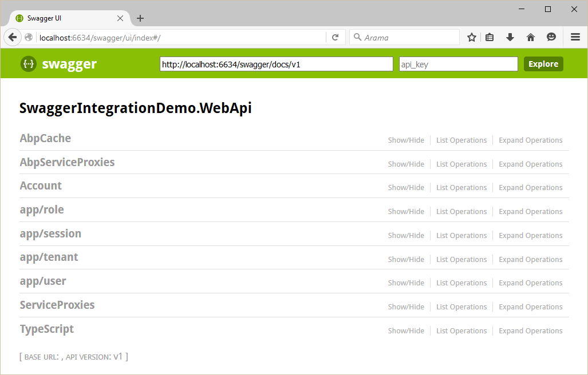

## 5.4 ABP分布式服务 - 集成SwaggerUI

### 5.4.1 简介
从官网得知，开启Swagger，你可以获得一个交互式的文档，生成和发现客户端SDK。

### 5.4.2 ASP.NET Core

#### 1. 安装
你可以很容易的集成[Swagger](http://swagger.io/)到基于ASP.NET Core的 ABP项目。

#### 2. 安装Nuget包

安装 [Swashbuckle](https://www.nuget.org/packages/Swashbuckle/6.0.0-beta902) nuget包到你的Web项目。

#### 3. 配置

在 **Startup.cs** 文件中找到 **ConfigureServices** 方法，并在该方法中为Swagger添加配置代码。

```csharp
public IServiceProvider ConfigureServices(IServiceCollection services)
{
    //其它代码...
    
    services.AddSwaggerGen();
    
    //其它代码...
}
```

然后在 **Startup.cs** 的 **Configure** 方法中添加如下配置：

```csharp
public void Configure(IApplicationBuilder app, IHostingEnvironment env, ILoggerFactory loggerFactory)
{
    //其它代码...

    app.UseSwagger();
    app.UseSwaggerUi(); //URL: /swagger/ui
}
```

在你使用 **swgger ui** 测试动态 **Web Api** 的时候，为了同时能够发送 **CSRF token**，你需要添加 swgger ui的 [index.html](https://github.com/swagger-api/swagger-ui/blob/master/dist/index.html) 文件到你的web项目。该文件应该精确的放在 **wwwroot\swagger\ui** 文件夹下。然后你需要更改swagger ui的index.html中已定义的 **onComplete** 方法，如下所示：

```javascript
onComplete: function(swaggerApi, swaggerUi){
  if(typeof initOAuth == "function") {
    initOAuth({
      clientId: "your-client-id",
      clientSecret: "your-client-secret-if-required",
      realm: "your-realms",
      appName: "your-app-name",
      scopeSeparator: " ",
      additionalQueryStringParams: {}
    });
  }

  if(window.SwaggerTranslator) {
    window.SwaggerTranslator.translate();
  }

  var csrfToken = abp.security.antiForgery.getToken();
  var csrfCookieAuth = new SwaggerClient.ApiKeyAuthorization(abp.security.antiForgery.tokenHeaderName, csrfToken, "header");
  swaggerUi.api.clientAuthorizations.add(abp.security.antiForgery.tokenHeaderName, csrfCookieAuth);

}
```

了解更多的配置选项请参考[Swashbuckle的文档](https://github.com/domaindrivendev/Ahoy)。

### 5.4.3 ASP.NET 5.x

#### 1. 安装

你可以很容易的集成Swagger到基于ABP创建的项目中。

#### 2. Nuget安装

安装 [Swashbuckle.Core](https://www.nuget.org/packages/Swashbuckle.Core/)到你的WebApi项目或者Web项目

#### 2. 配置

在你的模块的 **Initialize** 方法中添加配置Swagger的代码，如下所示：

```csharp
public class SwaggerIntegrationDemoWebApiModule : AbpModule
{
    public override void Initialize()
    {
        //其它代码...

        ConfigureSwaggerUi();
    }

    private void ConfigureSwaggerUi()
    {
        Configuration.Modules.AbpWebApi().HttpConfiguration
            .EnableSwagger(c =>
            {
                c.SingleApiVersion("v1", "SwaggerIntegrationDemo.WebApi");
                c.ResolveConflictingActions(apiDescriptions => apiDescriptions.First());
            })
            .EnableSwaggerUi(c =>
            {
                c.InjectJavaScript(Assembly.GetAssembly(typeof(AbpProjectNameWebApiModule)), "AbpCompanyName.AbpProjectName.Api.Scripts.Swagger-Custom.js");
            });
    }
}
```

>注意：在配置swagger ui的时候，我们注入的脚本文件名称是 **Swagger-Custom.js**。当你使用swagger ui来测试动态web api的时候，这个脚本文件被用来添加 **CSRF token** 到你的请求头中。你需要添加这个文件到你的WebApi项目中，并使用它的逻辑名(例如：你的项目名称.文件夹名称.脚本文件名称)在InjectJavaScript方法中注入它，该脚本文件一定要设置为 **Embedded Resource**。

该文件中的脚本内容如下：

```javascript
var getCookieValue = function(key) {
    var equalities = document.cookie.split('; ');
    for (var i = 0; i < equalities.length; i++) {
        if (!equalities[i]) {
            continue;
        }

        var splitted = equalities[i].split('=');
        if (splitted.length !== 2) {
            continue;
        }

        if (decodeURIComponent(splitted[0]) === key) {
            return decodeURIComponent(splitted[1] || '');
        }
    }

    return null;
};

var csrfCookie = getCookieValue("XSRF-TOKEN");
var csrfCookieAuth = new SwaggerClient.ApiKeyAuthorization("X-XSRF-TOKEN", csrfCookie, "header");
swaggerUi.api.clientAuthorizations.add("X-XSRF-TOKEN", csrfCookieAuth);
```

更多配置请参考[Swashbuckle文档](https://github.com/domaindrivendev/Swashbuckle)

### 5.4.4. 测试

按照如上配置后，让我们来浏览下文档 **/swagger/ui/index**：




你能看到所有的 Web Api Controllers 包括动态 Web Api Controllers，并且现在你可以测试它们。 


