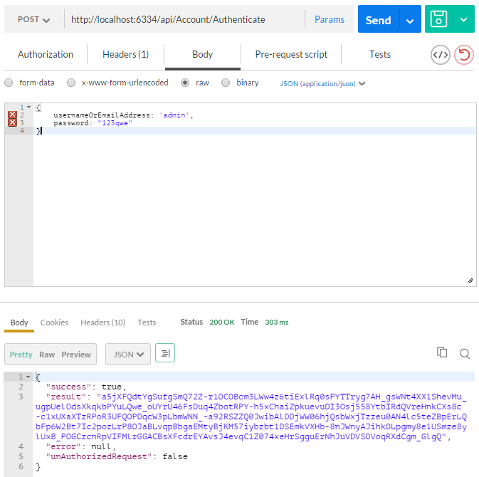
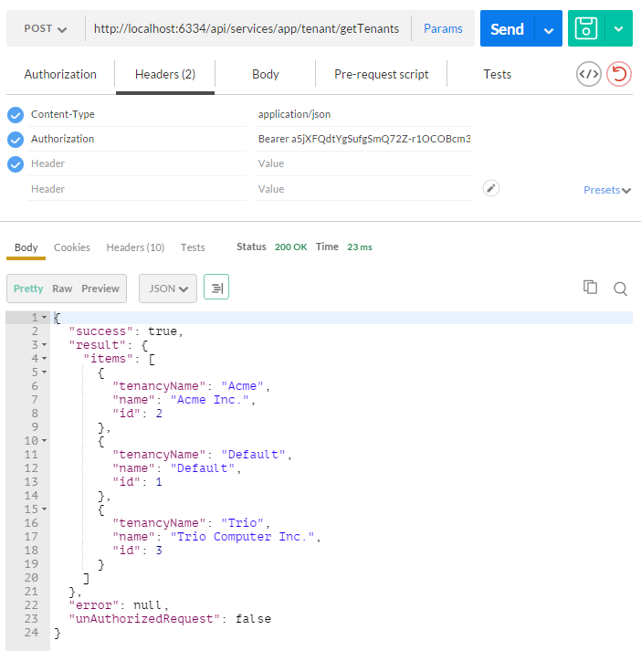
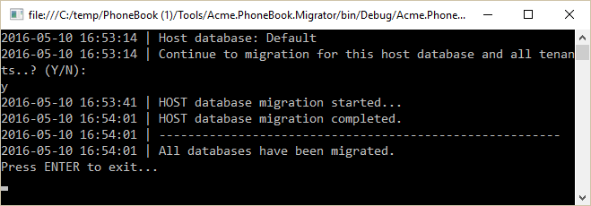

## 1.3 ABPZero - 启动模板

### 1.3.1 简介

使用ABP和moudle-zero开始一个新项目的最简单的方式是在[模板页](http://www.aspnetboilerplate.com/Templates)创建模板。记住要勾选 **Include module zero**。

在创建并且下载模板项目后：

+ 在VS2013+里面打开你的项目

+ 选择 **Web项目** 作为启动项目。

+ 打开包管理器控制台，选择 **EntityFramework** 项目作为默认项目并且运行 EntityFramework 的 **Update-Database** 命令。在使用这个命令后，它会创建该项目的数据库。你可以更改连接字符串在web.config文件里面。

+ 运行程序。默认：用户名是 **admin** 密码是 **123qwe**。

在这个模板中，**多租户模式** 默认是开启的。如果你不需要开启，那么你可以在Core项目中禁用它。

### 1.3.2 社交账号登录

启动模板支持 **Facebook，Twitter，Google+** 登录。在web.config文件里面，你可以看到以下配置：

```xml
<add key="ExternalAuth.Facebook.IsEnabled" value="false" />
<add key="ExternalAuth.Facebook.AppId" value="" />
<add key="ExternalAuth.Facebook.AppSecret" value="" />

<add key="ExternalAuth.Twitter.IsEnabled" value="false" />
<add key="ExternalAuth.Twitter.ConsumerKey" value="" />
<add key="ExternalAuth.Twitter.ConsumerSecret" value="" />

<add key="ExternalAuth.Google.IsEnabled" value="false" />
<add key="ExternalAuth.Google.ClientId" value="" />
<add key="ExternalAuth.Google.ClientSecret" value="" />
```

在这里，你可以根据你的需求来决定开启那些配置。当然，你必须从这些相关的网站去获取它的Keys和Passwords。你可以从这些网站找到相关指南来了解怎么获取key。一旦你开启了某个社交网站登录并且输入真实的key，那么你可以在登录界面看到一个按钮。按照相似的方法，你可以实现其它的社交登录方式。

### 1.3.3 基于令牌的身份验证

对于浏览器启动模板使用基于令牌的身份验证。然而，如果你想使用移动应用程序访问Web Api或者应用服务(那些通过[动态Web Api](/Markdown/ABP/5.2ABP分布式服务-动态WebApi层.md)暴露的应用服务)，那么你可能想要使用基于令牌的身份验证的机制。启动模板包括了不记名令牌验证基础设施。 在 **.WebApi** 项目中的 **AccountController** 包含了 **Authenticate** 的action，用来获取token。这样我们就可以在下一个请求中使用token。

在这里，我们使用 **Postman** (chrome扩展) 来展示 Requests 和 Reponses。

#### 身份验证

发送一个 **带有Context-Type="application/json"请求头的POST** 请求到 **http://localhost:6334/api/Account/Authenticate**，如下所示：



我们发送了一个包含 **userNameOrEmailAddress 和 password** 的 **JSON request body**。还有，我们应该把 **tenancyName** 设置为 **tenant** 用户。如上所示，返回的JSON对象的 **result** 属性包含了这个token。我们可以保存并在下个请求中使用它。

#### 使用API

在取得token和身份认证后，我们可以使用该令牌调用任何需要授权的action。对于所有应用服务的远程调用都是有效的。例如：我们可以使用 **Tenant Service** 来取得租户列表：



模拟一个 **带有Context-Type="application/json" 请求头的POST** 请求到 **http://localhost:6334/api/services/app/tenant/GetTenants** 并且 **Authorization="Bearer your- auth-token"**。请求体是空的 **{}**。当然，请求体和响应体将会使用不同的APIs。

在UI端的所有操作是有效的，那么对于Web Api操作也是有效的(因为在UI端使用的是相同的Web Api)并且可以很容易的被使用。


### 1.3.4 使用控制台迁移数据

启动模板包含了一个工具：**Migrator.exe**，使用这个工具可以轻松的迁移你的数据库。你可以运行这个应用来创建/迁移host和tenant的数据库。



这个应用程序可以从它自己的 **.config** 文件里面取得host的连接字符串。在开始的地方是与web.confg相同的。确认配置文件里面的连接字符串是你想要连接的数据库。然后获取主机连接字符串。首先创建主机数据库，或者应用迁移如果该数据库已经存在。然后，取得租户的连接字符串并且对这些数据库运行迁移。如果没有专门的数据库那么它会跳过该租户，或者对于那些已迁移租户的数据库也会跳过(多个租户之间共享数据库)。

你可以在开发或者生产环境中使用这个工具对数据库迁移部署，而不是使用EF它自己的Migrate.exe(这需要一些必要的配置并且一次运行只能针对单个数据库)。

### 1.3.5 单元测试

启动模板中包含了测试的基础设施设置，并且有少数几个测试已经被集成到了.Test项目中。你可以检测它们，并可以很容易的写一些类似的测试。事实上，它们是集成测试而不是单元测试，因为它们会使用ABP基础设施测试你的代码(包括数据验证，身份权限认证，以及工作单元等等)。

